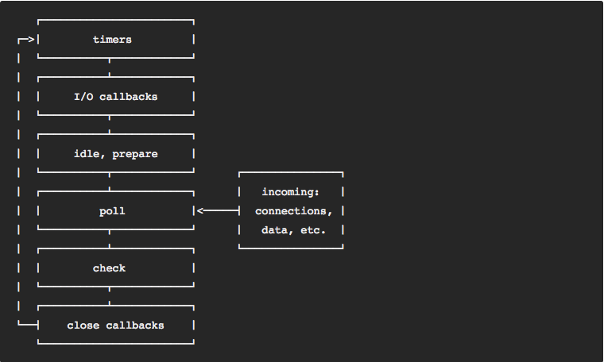

# Reference for various topics

## Examples of I/O operations
- Data tranfers from I/O devices (e.g. file I/O)
- Data transfers over the network (network calls)

## Ways for handling slow I/O operations
- Synchronous - Application process waits when I/O request is made (finally a system call).
    * Simplest solution
    * I/O operates at much slower speeds than processor - it is thus impractical as it a mammoth waste of CPU time
- Start a new process
    * Easy compared to multi-threading (see next point)
    * Need to take care of IPC
    * Does not scale well
- Start a new thread
    * Fast since lot of resources are shared with parent thread
    * Efficient use of resources including CPU
    * Complex - Difficult to write and maintain code for since there are concurrency issues that need to be taken care of
- Use an event loop (with event queues)
    * Use a queue with callback functions, i.e. functions that get called once the I/O operation is completed
    * Relies on concepts like closures to maintain memory inside of callbacks
    * There is only one thread of execution
    * Simplicity of code is a major advantage when compared to multi-threading
    * This is Node's solution to handling I/O!

## The Event Loop Architecture

### Gist of how the event loop works
The event loop consists of various queues whose items have callbacks associated with various I/O events. The items get added to various queues depending on how they get initiated for addition inside application code (we will see later) and the event types (eg. timer events vs file I/O events). When an event fires, the corresponding callbacks get added to an appropriate queue (this is done by Node runtime outside of V8), to be executed at the "next chance". When no synchronous code needs to be executed (i.e. function call stack of V8 is empty), Node loops through these queues executes the callbacks. When there is no synchronous code to be executed, and all queues are empty, the node process exits.  

The event loop has various phases and queue for each phase. The following image illustrates this.

__Source__: https://nodejs.org/en/docs/guides/event-loop-timers-and-nexttick/

__Exercises__
* Why shouldn't we execute long running operations in callback function?
* What happens if we use setTimeout with a delay of 0 ms? Does the callback function passed get executed right away?
* What is a "tick" (phase) of the event loop? If a callback queues further callbacks will all of those be executed in the current tick? If there are 100 callbacks queued up in a queue that is picked for execution in the current tick, is it guaranteed that all of them will be executed one after another immediately?

__References__
* [The Node.js Event Loop](https://nodejs.org/en/docs/guides/event-loop-timers-and-nexttick/)

## Components and Architecture of Node
* V8
    - The JS runtime by Google and used in Chrome
    - Has stack and heap memory for function calls and JS variables
* libuv 
    - Provides cross-platform (Windows, Mac OSX, Linux etc.) asynchronous operations
    - Resorts to thread only if the underlying platform does not have an asynchronous version of a required system call
    - Also provides the event loop
* Built-in JS modules and native C++ modules
    - The JS modules are the ones usually used when writing application code
    - The JS modules use the native C++ modules, which in turn uses V8 and libuv
    - Third-party modules can also be installed and used. Third-party C++ modules can be installed and used using a package called node-gyp